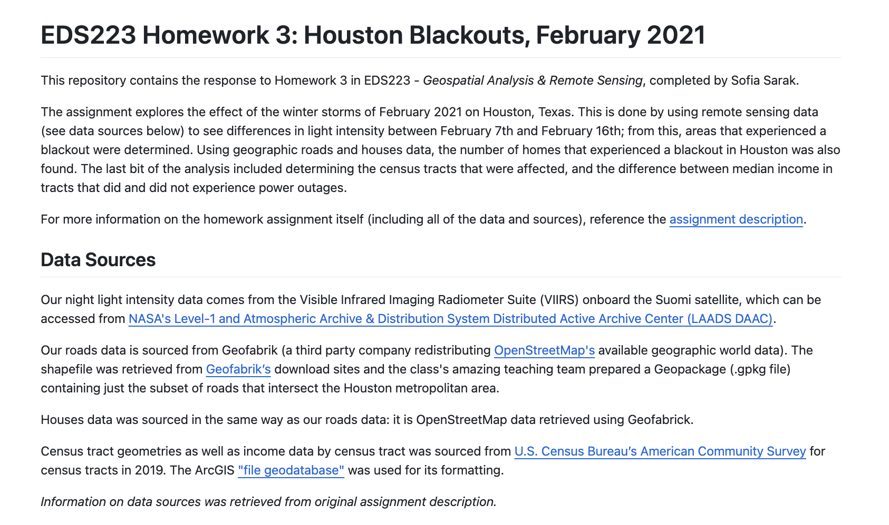
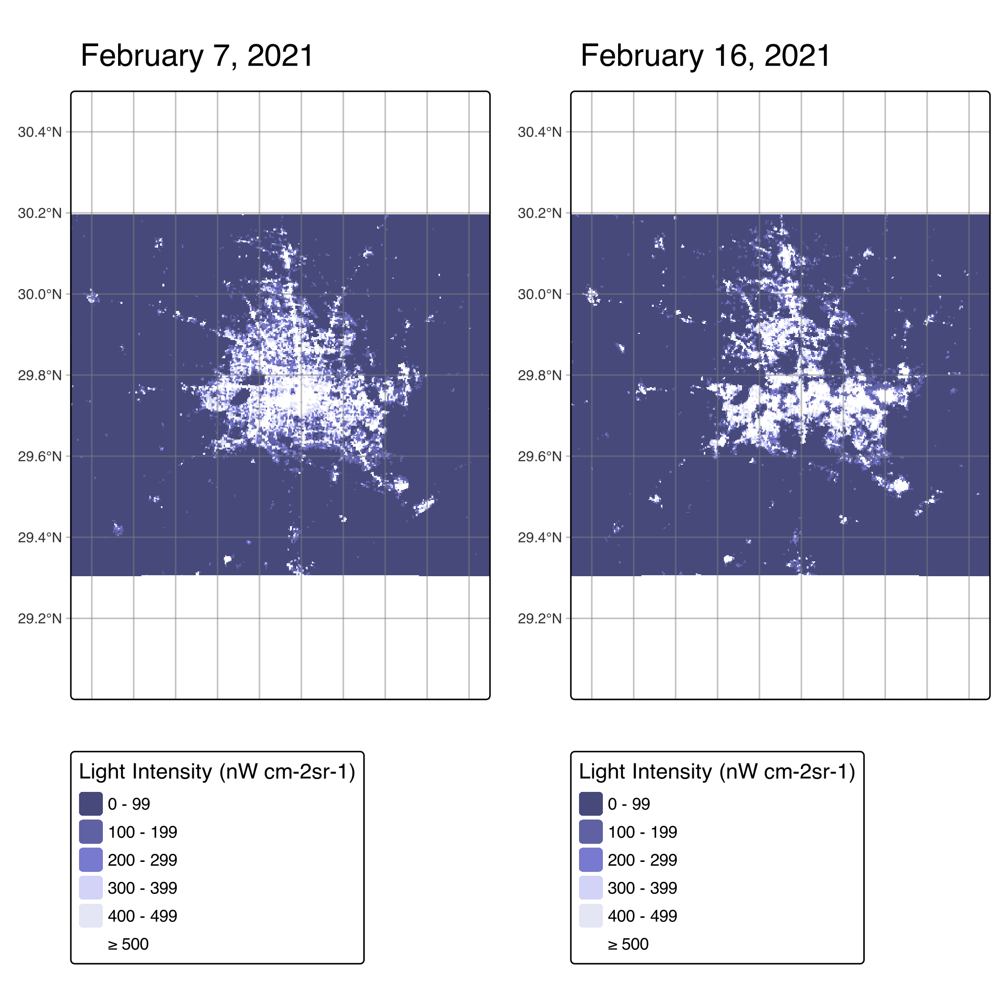
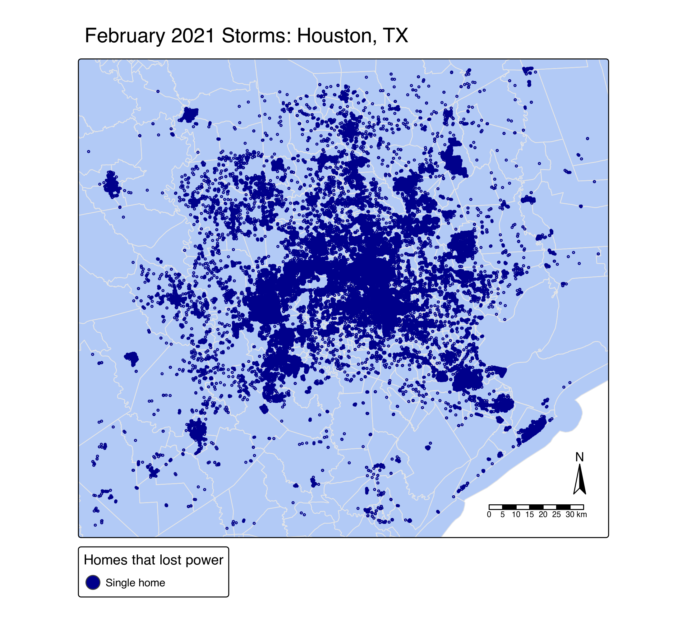
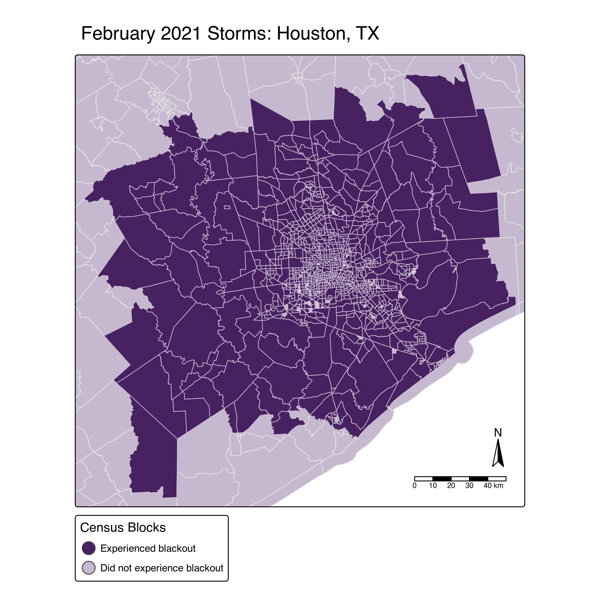
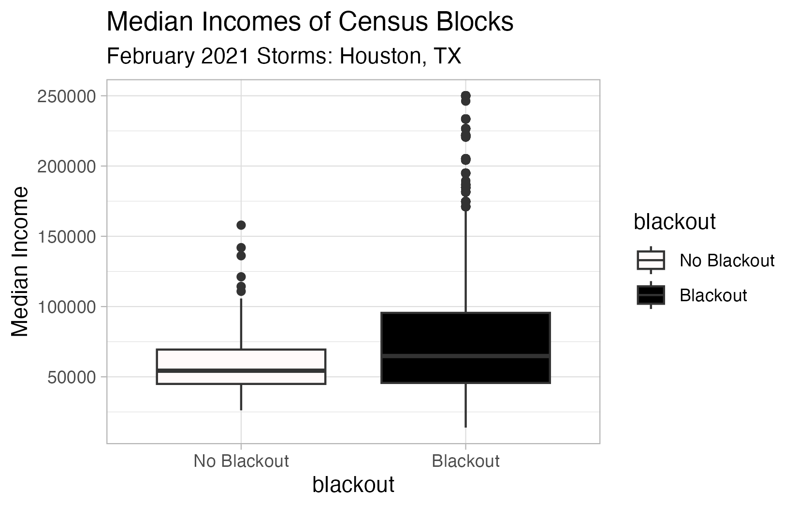

This quarto document contains analyses based in light intensity differences between February 7 and 16, 2021, in Houston, Texas. It compiles remotely-sensed night lights data, geographic features such as roads and buildings, and census income data. This exploration is meant to explore the power crisis that Texas experienced in February 2021 (due to winter storms), and reveal demographic information regarding which homes experienced a blackout.

**Github README**

{fig-align="center"}
{fig-align="center"}

## Initial Set Up

```{r}
#| output: false
#| message: false
# Loading necessary libraries
library(tidyverse)
library(here)
library(terra)
library(sf)
library(tmap)
library(stars)
```

## Data Cleaning

### Create Blackout Mask (night lights data)

Our night light intensity data comes from the Visible Infrared Imaging Radiometer Suite (VIIRS) onboard the Suomi satellite, which can be accessed from NASA's Level-1 and Atmospheric Archive & Distribution System Distributed Active Archive Center (LAADS DAAC).

We have four data sets in total: two days, and two tiles from each day. This is because Houston splits two of the tiles.

```{r}
#| output: false
# Loading in raster (night light) data
feb7_tile5 <- read_stars(here("data/VNP46A1/VNP46A1.A2021038.h08v05.001.2021039064328.tif"))
feb7_tile6 <- read_stars(here("data/VNP46A1/VNP46A1.A2021038.h08v06.001.2021039064329.tif"))
feb16_tile5 <- read_stars(here("data/VNP46A1/VNP46A1.A2021047.h08v05.001.2021048091106.tif"))
feb16_tile6 <- read_stars(here("data/VNP46A1/VNP46A1.A2021047.h08v06.001.2021048091105.tif"))
```

First, we must merge them by day.

```{r}
# Merging rasters together, by day
feb7_lights <- st_mosaic(feb7_tile5, feb7_tile6)
feb16_lights <- st_mosaic(feb16_tile5, feb16_tile6)
```

We can find the difference in light intensity between the two days by subtracting them.

```{r}
# Finding difference in light intensity
diff_light <-  feb7_lights - feb16_lights
```

We are only interested in areas where the drop in light intensity is greater than 200 nW cm-2sr-1. For the purposes of our analysis, this wil signify a blackout.

```{r}
# Assigning difference in light intensity to new object (to preserve original)
diff_mask <- diff_light

# All differences values less than 200 set as NA
diff_mask[diff_mask < 200] <- NA
```

```{r}
# Vectorizing mask to be able to use stars functions on it
vector_diff_mask <- diff_mask %>% 
  st_as_sf() %>% 
  st_make_valid()
```

We are only interested in the Houston area, so we will crop our geometries to its area.

```{r}
# Creating a polygon that defines the Houston area based on its coordinates
crop_box <- st_bbox(c(xmin = -96.5, xmax = -94.5, ymin = 29, ymax = 30.5), 
                    crs = st_crs(diff_mask)) %>% 
  st_as_sfc()
```

```{r}
#| warning: false
# Cropping our light intensity difference mask using our predefined crop polygon
diff_cropped <- st_crop(vector_diff_mask, crop_box)

# Ensuring that our cropping worked by checking for difference in cell number
if(ncell(vector_diff_mask) == ncell(diff_cropped)){
  warning("Cropping did not remove cells")
} else {
  print("Cropping removed cells")
}
```

This is our cleaned light intensity difference object! Our final step is to adjust it's CRS.

```{r}
# Transforming our final light intensity difference to have the NAD83 / Texas Centric Albers Equal Area CRS
diff_final <- st_transform(diff_cropped, crs = 3083)
```

### Exclude highways from cropped blackout mask

Highways could have experienced changes to light intensity that are unrelated to the storm, so we will exclude them from our mask.

Our roads data is sourced from Geofabrik (a third party company redistributing OpenStreetMap's available geographic world data). The shapefile was retrieved from Geofabrik’s download sites and the class's amazing teaching team prepared a Geopackage (.gpkg file) containing just the subset of roads that intersect the Houston metropolitan area.

```{r}
#| message: false
#| output: false
#| warning: false
# Loading in roads vector data (line object)
# The SQL query allows us to only load highway data (instead of all roads)
highways <- st_read("data/gis_osm_roads_free_1.gpkg",
                 query = "SELECT * FROM gis_osm_roads_free_1 WHERE fclass='motorway'") %>% 
  st_transform(crs = st_crs(diff_final)) %>%   # preemptively changing CRS to match our other data
  st_union()                                   

# by running st_union, we ensure that all of our roads are clumped into one geometry;
# this can help avoid long running times in the rest of our analysis
```

Creating 200 meter buffer around Houston roads.

```{r}
# st_buffer with specified units finds all areas within that distance for us
highways_200m <-  st_buffer(highways, dist = units::set_units(200, "m")) %>% 
  st_union()

# Combining roads data with its buffer to create single object with highways and 200m around them
highways_union <- st_union(highways, highways_200m)
```

Now, we find areas that experienced a blackout, but 200m away from highways.

```{r}
#| warning: false
# st_difference() will return all non-intersecting areas
blackout_no_highway <- st_difference(diff_final, highways_200m)
```

### Identify the number of homes likely impacted by blackouts

Houses data was sourced in the same way as our roads data: it is OpenStreetMap data retrieved using Geofabrick.

```{r}
#| output: false
#| message: false
#| warning: false
# Loading in houses vector data (multipolygon object)
# The SQl query allows us to only load in only homes, rather than all buildings
houses <- st_read(here("data/gis_osm_buildings_a_free_1.gpkg"),
                 query = "SELECT * FROM gis_osm_buildings_a_free_1
                          WHERE (type IS NULL AND name IS NULL)
                          OR type in ('residential', 'apartments', 'house', 'static_caravan', 'detached')") %>% 
  st_transform(crs = st_crs(diff_final)) # preemptively changing CRS to match our other data
```

We have to create a layer of homes that are only within our `blackout_no_highway` polygon. This is because we only want to see differences in light intensity greater than 200 nW cm-2sr-1 *and* unaffected by highway light changes.

```{r}
#st_join(st_contains)

# We use st_contains to find the houses that are fully contained by our blackout polygon
houses_blackout_sgbp <- st_contains(blackout_no_highway, houses)

# Convert sgbp list to an object of booleans (TRUE --> houses are in the blackout area)
houses_blackout_logical <- lengths(houses_blackout_sgbp) > 0 

# Subset only houses in blackout area from all houses data
houses_blackout <- houses[houses_blackout_logical, ] 

# Ensuring that our cropping worked by checking for difference in cell number
if(ncell(blackout_no_highway) == ncell(houses_blackout)){
  warning("Failed to extract house data 200m away from highways")
} else {
  print("Successfully extracted only houses affected by blackouts (200m away from highways)")
}
```

Note: Because we are using `st_contains()` in this wrangling step, we are only including houses that are fully contained by the blackout polygon (as in, excluding intersecting points).

### Blackout by Census Tracts

Census tract geometries as well as income data by census tract was sourced from U.S. Census Bureau’s American Community Survey for census tracts in 2019. The ArcGIS "file geodatabase" contains multiple layers of data, so we first extract this information to explore where our data of interest is stored, and then we can retrieve it.

```{r}
#| output: false
#| warning: false
#| messages: false
# Checking layers within our socioeconomic data
layers <-  st_layers(here("data/ACS_2019_5YR_TRACT_48_TEXAS.gdb"))

# Importing income and geometry layers
income <- st_read(here("data/ACS_2019_5YR_TRACT_48_TEXAS.gdb"), layer = "X19_INCOME")
census_tracts <- st_read(here("data/ACS_2019_5YR_TRACT_48_TEXAS.gdb"), layer = "ACS_2019_5YR_TRACT_48_TEXAS")
```

```{r}
#| warning: false
# Cropping our light intensity difference mask using our predefined crop polygon

crop_box_census <- st_transform(crop_box, crs = 3083)
census_tracts <- st_transform(census_tracts, crs = st_crs(crop_box_census))
census_cropped <- st_crop(census_tracts, crop_box_census)

# Ensuring that our cropping worked by checking for difference in cell number
if(ncell(census_tracts) == ncell(census_cropped)){
  warning("Cropping did not remove cells")
} else {
  print("Cropping removed cells")
}
```

For this analysis we will use median income. The income layer contains a lot of other data, so we will clean it up to only contain GEOID (which we will need to combine with our spatial data) and median income. We will also clean census tract data to match.

```{r}
# Select only variables of interest from income data
income <- income %>% 
  select("GEOID", "B19013e1") %>%  
  rename(median_income = B19013e1)   # Rename median income column to be more clear

# census_tracts stores geo_ID under a different column names -- fixing it to match income
census_cropped <- census_cropped %>% 
  select(-GEOID) %>%                # It also contained a different, unecessary 'GEOID' column; remove it
  rename(GEOID = GEOID_Data)
```

Our final goal for initial census data cleaning and merging is a data frame with census tract geometries and median income information. We do this by joining the two data frames.

```{r}
# Combine the two layers
income_tracts <- left_join(census_cropped, income, by = "GEOID")
```

We now want to know which census tracts contain houses that experienced a blackout. To do this, we first combine house data with our `income_tracts` data frame.

By utilizing a left join, we can ensure that we keep *all* income tracts, and insert NA values where a house experiencing a blackout was not found.

```{r}
# Ensuring income_tracts has the same CRS
income_tracts <- st_transform(income_tracts, crs = st_crs(houses_blackout))

# Creating a geometry containing only the tracts that have houses with a blackout
houses_tracts <- st_join(income_tracts, houses_blackout, left = TRUE) # keep only tracts that have houses blackout, set join = st_disjoint
```

We can create a new column called `blackout`, and fill it with TRUE/FALSEs based on whether there was a house that experienced a blackout in that census tract (TRUE = there was). We can base this on the `osm_id` column of our `houses_tracts` data frame, because it contains IDs for the blackout houses. If there is no ID (NA), we assume that there is no blackout house in that census tract.

```{r}
# Create new variable 'blackout' where TRUE if osm_id has data
houses_tracts$blackout <- houses_tracts$osm_id > 0

# Replace the NAs in the blackout column with FALSE, for areas with no houses experiencing a blackout
houses_tracts$blackout <- houses_tracts$blackout %>% 
  replace_na(FALSE)
```

Great! Now we have a dataframe containing census tract geometries, their associated median incomes, and information on whether or not any houses in that tract experienced a blackout.

For mapping purposes, we will also create an object that is just the census tracts which contain houses that experienced a blackout.

```{r}
# Transform CRS' to match
census_tracts <- st_transform(census_tracts, crs = st_crs(houses_blackout))

# Filter census_tracts to only include tracts that contain houses with blackouts
census_blackout <- st_filter(census_tracts, houses_blackout)
```

## Maps, Figures and Reflection

The following section contains the following outputs:

-   a set of maps comparing night light intensities before and after the first two storms
-   a map of the homes in Houston that lost power
-   an estimate of the number of homes in Houston that lost power
-   a map of the census tracts in Houston that lost power
-   a plot comparing the distributions of median household income for census tracts that did and did not experience blackouts
-   a brief reflection (approx. 100 words) summarizing your results and discussing any limitations to this study

### Comparing Light Intensities (Map)

We can visualize the difference in light intensity by plotting our remote sensing data, by day. We will color by nW cm-2sr-1 to examine differences between February 7th (before storm) and February 16th (after storm).

Before we plot, we first want to prepare our light intensity data by cropping it to just the Houston area. Additionally, we make a color palette for representing light changes.

```{r}
# Cropping both days of our light data to just the Houston area
# Using previously made crop box
feb7_cropped <- st_crop(feb7_lights, crop_box)
feb16_cropped <- st_crop(feb16_lights, crop_box)

# Setting custom color palette; lighter colors represent greater light intensity
night_light_colors <- c("0" = "#47497a", 
                        "100" = "#5f61a3",
                        "200" = "#787acf", 
                        "300" = "#d2d3f7", 
                        "400" = "#e4e5f5", 
                        "500" = "white")
```

Plot using `tm_shape()` (which the subsequent maps will also be created with).

```{r}
#| messages: false
#| warning: false
#| execute: false

feb7_plot <- tm_shape(feb7_cropped) +
  tm_raster(breaks = c(0, 100, 200, 300, 400, 500, Inf),
            palette = night_light_colors,
            title = "Light Intensity (nW cm-2sr-1)") +
  tm_title(text = "February 7, 2021") +
  tm_graticules(alpha = 0.5)

tmap_save(feb7_plot, "feb7_plot.png")

feb16_plot <- tm_shape(feb16_cropped) +
  tm_raster(breaks = c(0, 100, 200, 300, 400, 500, Inf),
            palette = night_light_colors,
            title = "Light Intensity (nW cm-2sr-1)") +
  tm_title(text = "February 16, 2021") +
  tm_graticules(alpha = 0.5)

tmap_save(feb16_plot, "feb16_plot.png")

both_plots <- tmap_arrange(feb7_plot, feb16_plot, nrow = 1)
tmap_save(both_plots, "both_plots.png")

```


**Difference in Light Intensity** 
{fig-align="center"}

### Homes in Houston that Lost Power (Map & Estimate)

**Map**

```{r}
#| messages: false
#| warning: false
#| execute: false

houses_plot <- tm_shape(census_tracts, bbox = houses_blackout) + # Plot census tracts 
  tm_polygons(fill = "cornflowerblue",
              alpha = 0.5,
              border.col = "gray90",
              lwd = 0.75) +
tm_title(text = "February 2021 Storms: Houston, TX") +
tm_compass() +
tm_scale_bar() +
tm_shape(houses_blackout) +                                    # Plot houses affected by blackout as points
  tm_symbols(fill = "cornflowerblue",
             border.col = "darkblue",
             alpha = 0.5,
             size = 0.15,
             legend.show = TRUE) +
  tm_add_legend(type = "symbol",                               # Adding custom legend
              labels = c("Single home"),
              fill = c("darkblue"),
              title = "Homes that lost power",
              is.portait = TRUE)

tmap_save(houses_plot, "houses_plot.png")
```

{fig-align="center"}

**Estimate**

Our data frame `houses_blackout` only contains houses in areas that we determined experience a blackout. Therefore, to find the number of homes in Houston that experiences a blackout, we can simply count the number of rows in our data frame.

```{r}
# nrow() to find number of rows in dataframe
houses_estimate <- nrow(houses_blackout)
print(houses_estimate)
```

The number of homes that lost power in Houston between February 7th and 16th, 2021 is 253,644.

### Blackout and Census Tract

We have two data frames we can plot to give us this information: - `houses_blackout`, which contains geometries of census blocks that contain houses that experienced a blackout. - `census_tracts`, which is just the census tracts geometries, that we can underlay to ensure the entire picture of Houston

```{r}
#| messages: false
#| warning: false
#| execute: false

census_blackout_plot <- tm_shape(census_tracts, bbox = census_blackout) +      # Plot all census tracts
  tm_polygons(fill = "#c6b8cf",
              border.col = "gray90",
              lwd = 0.75) +
tm_shape(census_blackout) +                            # Plot just the census tracts experiencing blackout
  tm_polygons(fill = "#482161",
              border.col = "#c6b8cf",
              lwd = 0.75) +
tm_add_legend(labels = c("Experienced blackout", "Did not experience blackout"),
              fill = c("#482161", "#c6b8cf"),
              title = "Census Blocks",
              is.portait = TRUE) +
tm_title("February 2021 Storms: Houston, TX") +
tm_compass() +
tm_scale_bar()

tmap_save(census_blackout_plot, "census_blackout_plot.png")
```


{fig-align="center"}


### Distribution of Median Income

We can use a density plot and our `houses_tracts` data frame to show the distribution of median income of census tracts, comparing between those that did and did not experience a blackout based on our analysis.

```{r}
#| messages: false
#| warning: false
#| execute: false

# Create plot using ggplot2
median_income_plot <- ggplot(data = houses_tracts, 
       aes(x = blackout, y = median_income)) +
  geom_boxplot(aes(fill = blackout)) +                           # Specify separate plots by blackout
  labs(title = "Median Incomes of Census Blocks",
       subtitle = "February 2021 Storms: Houston, TX",
       y = "Median Income") +
  scale_x_discrete(labels =                                      # Change labels to be more intuitive   
                     c("FALSE" = "No Blackout", "TRUE" = "Blackout")) +      
    theme_light() +
    scale_fill_manual(values = c("snow", "black"), 
                      labels = c("No Blackout", "Blackout")) +   # Customize legend to fit labels
  theme(legend.title = element_blank()) +                        # Remove legend title
  theme_light()

ggsave(filename = "median_income_plot.png", plot = median_income_plot)
```
{fig-align="center"}

### Reflection

Our analysis confirms that the vast majority of Houston experienced a blackout after the storm between February 7th and February 16th. From our visualizations we can see that light intensity decreased between the two days, over 250,000 houses were affected, and few census tracts were spared. Additionally, we see that the census tracts that did not experience a black out had median incomes distributed at slightly higher values than census tracts that did.

Limitations of this study include that our designation of "blackout" was determined by light intensity, instead of power outage data, for example. Therefore, there may be patterns to light intensity that we are not controlling for. Additionally, we are comparing data from only two days -- snapshots in time, that may not represent the true impact. For example, there was a winter storm from February 15th to 20th that we may be excluding.
